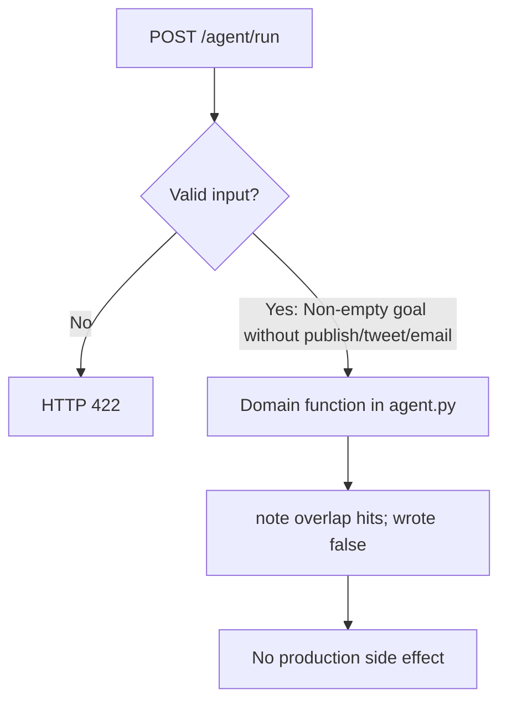

# Research Agent: process flows

## Domain request

Endpoint: `POST /agent/run`. Stages summarize [src/research/agent.py](../src/research/agent.py). This is in-process Python, not a hosted model or production apply.

See [INTERVIEW_QA.md](../INTERVIEW_QA.md) for fixture walkthroughs and [PROJECT_ARCHITECTURE.md](../PROJECT_ARCHITECTURE.md) for the component map.
